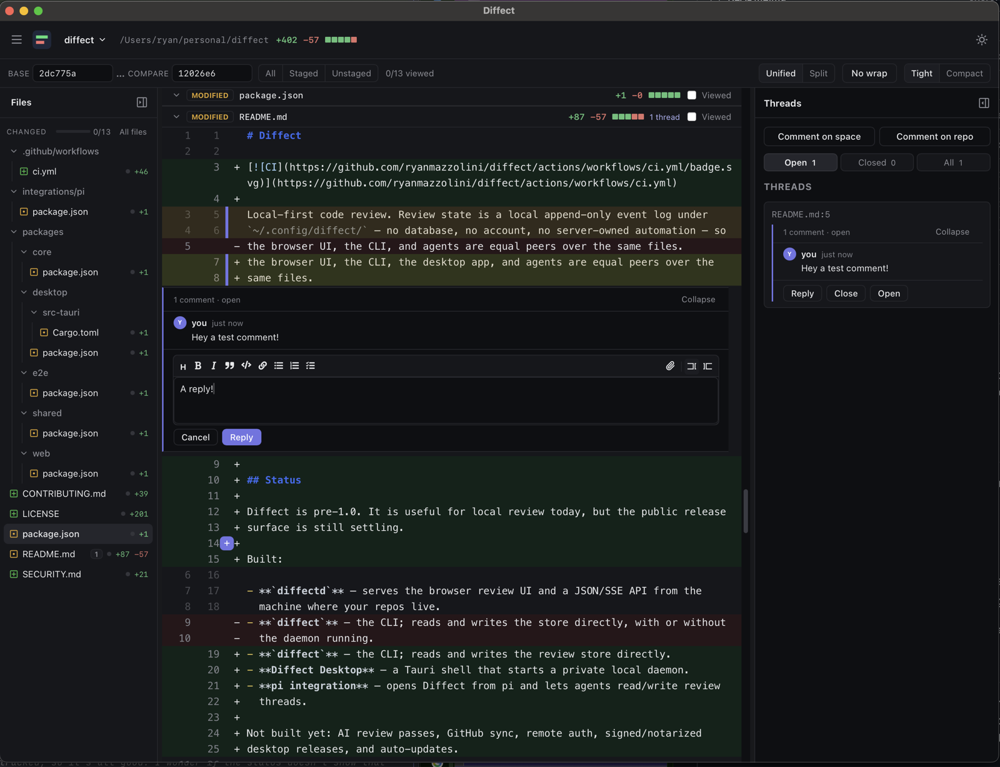

#  Diffect

[](https://github.com/ryanmazzolini/diffect/actions/workflows/ci.yml)

Browser + desktop code review for repos, worktrees, and multi-repo AI coding
spaces.

Diffect runs beside the code — on your laptop, dev box, or trusted remote host —
and opens a GitHub-style review UI in the browser or desktop app.

- review `work`, `staged`, `unstaged`, refs, or base↔compare ranges
- review one repo or a whole folder of repos/worktrees as one task space
- leave durable inline comments that re-anchor or go stale as code changes
- let agents read and update the same threads; pi is the first integration
- keep review state in local files under `~/.config/diffect/`

<p align="center">
  
</p>

## Status

Diffect is experimental but usable from a source checkout or a downloadable
desktop build. Hosted review, GitHub sync, auth, signed installers, and
auto-updates are not built yet. The current macOS downloads are ad-hoc signed,
so macOS may ask you to confirm the first launch.

## Install the desktop app

Each [GitHub release](https://github.com/ryanmazzolini/diffect/releases) includes
a Linux x86_64 AppImage and zipped macOS apps for Apple Silicon and Intel.
Release assets include SHA-256 checksums and GitHub build provenance.

To install the latest stable release as `diffect-desktop` with
[mise](https://mise.jdx.dev):

```sh
# Linux x86_64
mise use -g 'github:ryanmazzolini/diffect[matching=linux,bin=diffect-desktop]@latest'

# macOS Apple Silicon; use matching=macos-x86_64 on an Intel Mac
mise use -g 'github:ryanmazzolini/diffect[matching=macos-aarch64,strip_components=0,bin_path=Diffect.app/Contents/MacOS,filter_bins=diffect-desktop]@latest'
```

Mise's GitHub backend ignores prereleases for `latest`. Run `mise upgrade` to
install a newer stable release when one is available. You can instead download
the platform asset directly from the release page; make a downloaded AppImage
executable before launching it.

## Layout

```text
packages/
  shared/   contract types shared by daemon, CLI, and web UI
  core/     diffect CLI + diffectd daemon + git diff + event log
  web/      React + Vite browser UI served by diffectd
  desktop/  Tauri shell over a private diffectd
  e2e/      Playwright coverage
integrations/
  pi/       local pi package and tools
```

## Run from source

Tooling is pinned with [mise](https://mise.jdx.dev). Dependencies install with
lifecycle scripts disabled and a 3-day npm release-age cooldown.

```sh
mise install
pnpm install
mise run daemon -- --workspace /path/to/repo
# open http://127.0.0.1:7421
```

`--workspace` defaults to the current directory. Drop it to review the repo
you're standing in.

For the desktop app:

```sh
mise run desktop
```

For UI hot reload:

```sh
mise run daemon   # terminal 1
mise run dev      # terminal 2
```

## CLI

Until packages are published, alias the built CLI from a checkout:

```sh
pnpm build
alias diffect="node /path/to/diffect/packages/core/dist/cli.js"

cd /path/to/repo
diffect list --status open
diffect comment --file src/a.ts --line 42 --severity must-fix --body "…"
diffect reply <id> --agent pi --body "fixed"
diffect resolve <id> --summary "fixed in this change"
```

The default target is `work` (committed-since-base + unstaged + untracked). Pick
another with `--target staged|unstaged|<ref>|<a>..<b>`, and a specific checkout
with `--repo`/`--worktree`.

## Develop

```sh
mise run build
mise run test
mise run desktop:check
```

Release Please maintains a release PR from Conventional Commits on `main`.
Merging that reviewed PR creates a draft release; GitHub Actions builds and
attests every desktop asset, then publishes the release only after all platform
builds succeed. A failed draft can be retried from the Release workflow by
providing its `vX.Y.Z` tag.

See [CONTRIBUTING.md](CONTRIBUTING.md) for contributor notes and
[integrations/pi](integrations/pi/README.md) for agent usage.

## Where reviews live

Review state is a per-user store at `$XDG_CONFIG_HOME/diffect/` (default
`~/.config/diffect/`). Repo threads live in
`workspaces/<hash>/threads.jsonl`; space-level threads live in
`spaces/<hash>/threads.jsonl`; attachments live in `attachments/`; and
`workspaces.json` records known workspace paths. The hashes are derived from
absolute paths, but the files stay host-private and are not committed with your
code.

The CLI, daemon, desktop app, and agents all read/write that same store. A
legacy in-tree `.reviews/threads.jsonl` from older versions is migrated into the
central store on first access; the original is left as a backup.

## Networking and security

`diffectd` binds to `127.0.0.1` by default. There is no auth yet, so only expose
it inside a trusted network if you override `--host`. Report vulnerabilities
privately; see [SECURITY.md](SECURITY.md).

## License

Apache-2.0. See [LICENSE](LICENSE). Vendored editor icons are attributed in
[third-party assets](docs/third-party-assets.md).

## Related projects

- [hunk](https://github.com/modem-dev/hunk) — terminal review UI for
  agent-authored changesets.
- [herdr](https://github.com/ogulcancelik/herdr) — terminal workspace manager
  for AI coding agents.
- [cmux](https://github.com/manaflow-ai/cmux) — macOS terminal/workspace for AI
  coding agents.
- [diffity](https://diffity.com) by [Kamran Ahmed](https://kamranahmed.se) — a
  GitHub-style git diff viewer in the browser, and the visual inspiration for
  Diffect's diff view.
